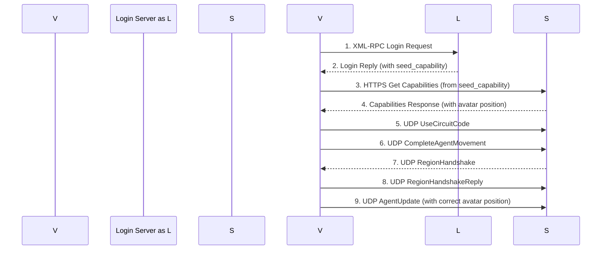

# slv-rust Login Flow vs. Official Flow

This document outlines the key differences and improvements in the `slv-rust` login sequence compared to the "official" flow described in `official_flow.md`.

## Key Improvements in `slv-rust`

The `slv-rust` implementation takes a more modern and robust approach to the login sequence, addressing several of the known issues present in the traditional flow.

1.  **Capabilities First:** The most significant improvement is that `slv-rust` fetches the simulator's capabilities via an HTTPS `seed_capability` request *before* initiating the UDP connection. This allows the viewer to have a complete picture of the simulator's features and the agent's state (including the correct initial avatar position) before sending any UDP packets.

2.  **No Bogus `AgentUpdate`:** By fetching capabilities first, `slv-rust` avoids the problematic "bogus `AgentUpdate`" described in `official_flow.md`. The viewer knows the avatar's correct position from the start, eliminating the initial "jump" and reducing the likelihood of interest list errors.

3.  **Asynchronous Operations:** The entire login process is built on an asynchronous model using `tokio`. This allows for non-blocking I/O, making the login process more efficient and responsive. For example, the initial login, capability fetching, and UDP handshake are all handled as separate asynchronous tasks.

4.  **Clear Handshake State Machine:** The `HandshakeState` enum in `session.rs` provides a clear and explicit state machine for the UDP handshake process. This makes the code easier to understand, debug, and maintain compared to the more implicit and fragile sequencing of the traditional flow.

## `slv-rust` Login Sequence

Here is a simplified sequence diagram of the `slv-rust` login flow:

## Conclusion

The `slv-rust` login flow is a significant improvement over the traditional sequence. By prioritizing capability fetching and leveraging modern asynchronous programming practices, it creates a more reliable, efficient, and less error-prone login experience. This modern approach aligns with the project's goal of being "Performance by Default, Scalable by Design."
